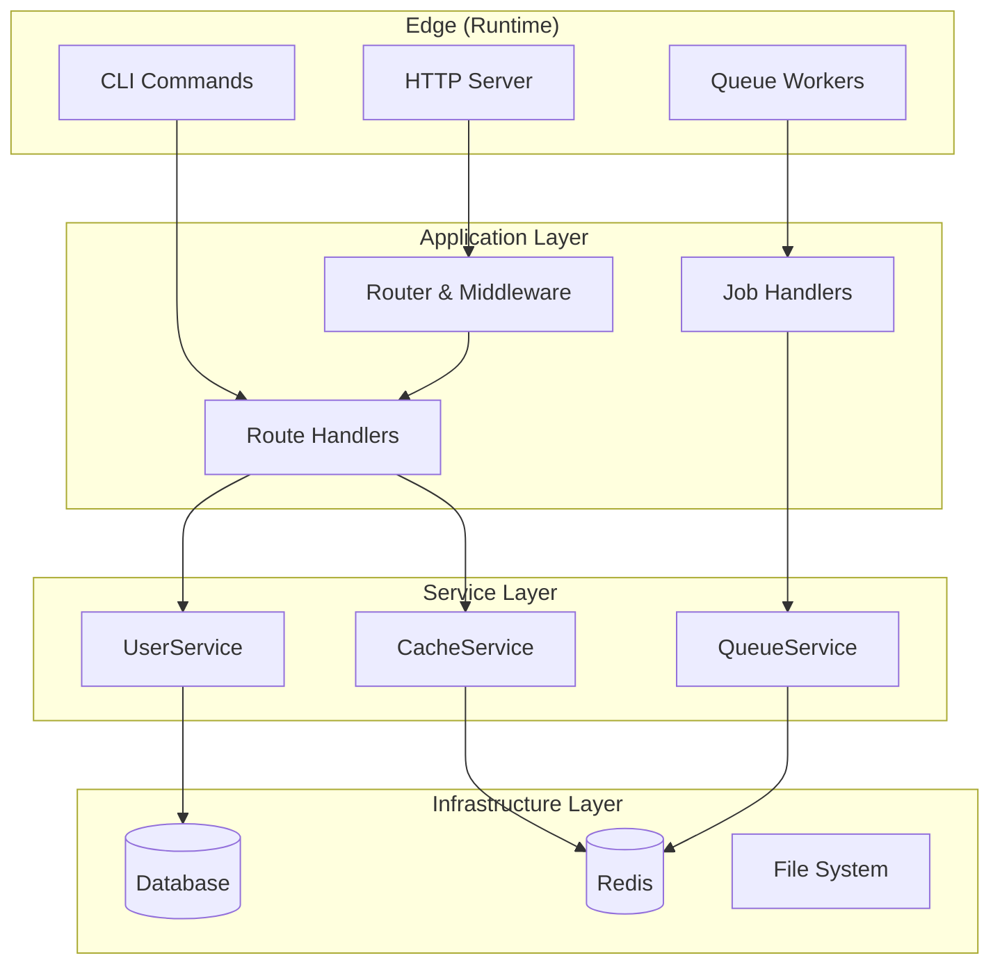

import { Callout } from 'fumadocs-ui/components/callout';
import { Card, Cards } from 'fumadocs-ui/components/card';
import { Step, Steps } from 'fumadocs-ui/components/steps';

Gello is a sophisticated backend framework that combines the best ideas from established frameworks with Effect's functional programming paradigm:

- **Laravel's Developer Experience** — Elegant APIs, powerful CLI, sensible defaults
- **Ruby on Rails' Philosophy** — Convention over configuration, developer productivity
- **NestJS's Modularity** — Service-oriented architecture, clean dependency injection
- **Effect's Type Safety** — Functional programming, compile-time error handling

Built on [Effect](https://effect.website) and [@effect/platform](https://github.com/Effect-TS/effect/tree/main/packages/platform), Gello follows the principle: **program = value, interpret at the edge**.

## Architecture Overview



## Core Philosophy

<Callout type="info" title="The Gello Way">
Build applications as pure values, compose them with Layers, and interpret at the edge.
No magic, no hidden state, just functions and types.
</Callout>

- **No Module Abstraction**: Just compose Layers for dependencies and handlers that `yield*` from context
- **Scoped Resources**: Database pools, Redis connections — all managed with `Layer.scoped` and `acquireRelease`
- **Typed Boundaries**: Use `@effect/schema` for request/response validation at the edge
- **Single Composition Point**: All layers merge at one root, then `Layer.launch`

## Quick Example

```typescript
import { Context, Effect, Layer, pipe } from "effect"
import * as S from "@effect/schema/Schema"
import * as HttpRouter from "@effect/platform/HttpRouter"
import * as HttpServer from "@effect/platform/HttpServer"
import * as HttpServerResponse from "@effect/platform/HttpServerResponse"
import * as NodeHttpServer from "@effect/platform-node/NodeHttpServer"
import * as NodeRuntime from "@effect/platform-node/NodeRuntime"
import { createServer } from "node:http"

// 1) Define a service with Context.Tag
class UserRepo extends Context.Tag("UserRepo")<
  UserRepo,
  { getAll: () => Effect.Effect<User[]> }
>() {}

// 2) Implement as a Layer
const UserRepoLive = Layer.effect(
  UserRepo,
  Effect.gen(function* () {
    const db = yield* Db
    return {
      getAll: () => Effect.tryPromise(() => db.select().from(users))
    }
  })
).pipe(Layer.provide(DbLive))

// 3) Build routes that yield* dependencies
const AppRouter = pipe(
  HttpRouter.empty,
  HttpRouter.get("/users", Effect.gen(function* () {
    const repo = yield* UserRepo
    const users = yield* repo.getAll()
    return yield* HttpServerResponse.schemaJson(S.Array(User))(users)
  }))
)

// 4) Compose all layers at the edge
const AppLayer = Layer.mergeAll(ConfigLive, DbLive, UserRepoLive)

const MainLayer = pipe(
  HttpServer.serve(HttpRouter.toHttpApp(AppRouter)),
  Layer.provide(AppLayer),
  Layer.provide(NodeHttpServer.layer(createServer, { port: 3000 }))
)

Layer.launch(MainLayer).pipe(NodeRuntime.runMain)
```

## What This Gives You

<Cards>
  <Card title="Resource Safety" description="Pools close on shutdown, connections release properly" />
  <Card title="Testability" description="Swap any Layer for a mock — no DI container ceremony" />
  <Card title="Type Inference" description="The compiler knows exactly what dependencies each handler needs" />
  <Card title="No Magic" description="It's just functions and values, all the way down" />
</Cards>

## Quick Start

<Steps>
<Step>
### Create a new project

```bash
npx gello new my-app
```
</Step>
<Step>
### Install dependencies

```bash
cd my-app
pnpm install
```
</Step>
<Step>
### Start development server

```bash
pnpm dev
```
</Step>
</Steps>

## Packages

Gello is organized into focused packages:

| Package | Description |
|---------|-------------|
| `@gello/core` | Core contracts, errors, and base types |
| `@gello/common` | Middleware, routing, validation utilities |
| `@gello/platform-node` | Node.js HTTP adapter |
| `@gello/queue` | Effect-native queue system |
| `@gello/auth` | Authentication, authorization, and OAuth |
| `@gello/fp` | Optics, refined types, FP utilities |
| `@gello/testing` | Testing utilities and mocks |

## Requirements

- **Node.js** 20.0+
- **TypeScript** 5.4+
- **Effect** 3.x
